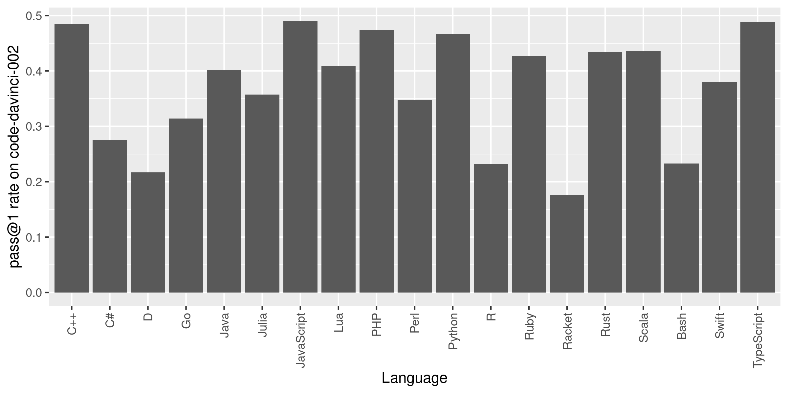

# Introduction

_MultiPL-E_ is a multi-programming language benchmark for evaluating the code
generation performance of large language model (LLMs) of code.

We use a suite of compilers to translate the Python benchmarks from [Chen et al.
2021] into parallel benchmarks in 18 programming languages. Thus MultiPL-E
provides a way to evaluate code generation models on a consistent set of
benchmark problems across many languages. The 18 languages capture a broad
spectrum of language features, application areas, and popularity, allowing us to
explore the impact of these factors on model performance.

Here are some examples of translated problems and Codex-generated solutions in a selection of languages:

  <ul class="slides">
    <input type="radio" name="radio-buttons" id="img-1" checked />
    <li class="slide-container">
      

          <iframe src="code-html/HumanEval_78_hex_key-188-OK.cpp.html" id="code-1"></iframe>
      

      

        <label for="img-5" class="prev-slide">
          &lsaquo;
        </label>
        <label for="img-2" class="next-slide">
          &rsaquo;
        </label>
      

    </li>
    <input type="radio" name="radio-buttons" id="img-2" />
    <li class="slide-container">
      

          <iframe src="code-html/HumanEval_117_select_words-124-OK.sh.html" id="code-2"></iframe>
      

      

        <label for="img-1" class="prev-slide">
          &lsaquo;
        </label>
        <label for="img-3" class="next-slide">
          &rsaquo;
        </label>
      

    </li>
    <input type="radio" name="radio-buttons" id="img-3" />
    <li class="slide-container">
      

          <iframe src="code-html/HumanEval_47_median-196-OK.cs.html" id="code-3"></iframe>
      

      

        <label for="img-2" class="prev-slide">
          &lsaquo;
        </label>
        <label for="img-4" class="next-slide">
          &rsaquo;
        </label>
      

    </li>
    <input type="radio" name="radio-buttons" id="img-4" />
    <li class="slide-container">
      

          <iframe src="code-html/HumanEval_89_encrypt-191-OK.rs.html" id="code-4"></iframe>
      

      

        <label for="img-3" class="prev-slide">
          &lsaquo;
        </label>
        <label for="img-5" class="next-slide">
          &rsaquo;
        </label>
      

    </li>
    <input type="radio" name="radio-buttons" id="img-5" />
    <li class="slide-container">
      

          <iframe src="code-html/HumanEval_15_string_sequence-190-OK.ts.html" id="code-5"></iframe>
      

      

        <label for="img-4" class="prev-slide">
          &lsaquo;
        </label>
        <label for="img-1" class="next-slide">
          &rsaquo;
        </label>
      

    </li>
    

      <label for="img-1" class="carousel-dot" id="img-dot-1"></label>
      <label for="img-2" class="carousel-dot" id="img-dot-2"></label>
      <label for="img-3" class="carousel-dot" id="img-dot-3"></label>
      <label for="img-4" class="carousel-dot" id="img-dot-4"></label>
      <label for="img-5" class="carousel-dot" id="img-dot-5"></label>
    

  </ul>

The following graph shows the success rate of OpenAI Codex on the
complete benchmark across the full suite of programming languages:

[Our paper] also reports the performance on InCoder, and presents more
in depth analyses. Some of our findings include:

1. Codex performs best on JavaScript and equally well on C++, Scala, and
   TypeScript as on Python.

2. Model perplexity is not strongly correlated with the correctness of generated
   code.

3. Type annotations have limited impact on model performance for gradually typed
   languages.

4. Model performance is correlated with language popularity, but some niche
   languages perform as well as more popular languages.

## Using MultiPL-E

The MultiPL-E benchmark and associated tools are open source and easy to extend.
Each compiler translates Python unit tests, doctests, and function signatures to
its target language. Because these program regions do not contain arbitrary
Python code, each compiler is much simpler than a full-fledged compiler. It is
easy to add new benchmark programs and to extend the benchmark to additional
languages. The [tutorial](./tutorial.html) walks you through
running our benchmarks and gives guidance on adding support for [new languages],
[new benchmarks], and [evaluating new models].

[chen et al. 2021]: https://arxiv.org/abs/2107.03374
[new languages]: ./new_language.html
[new benchmarks]: ./new_benchmark.html
[evaluating new models]: ./new_model.html
[our paper]: https://arxiv.org/abs/2208.08227
