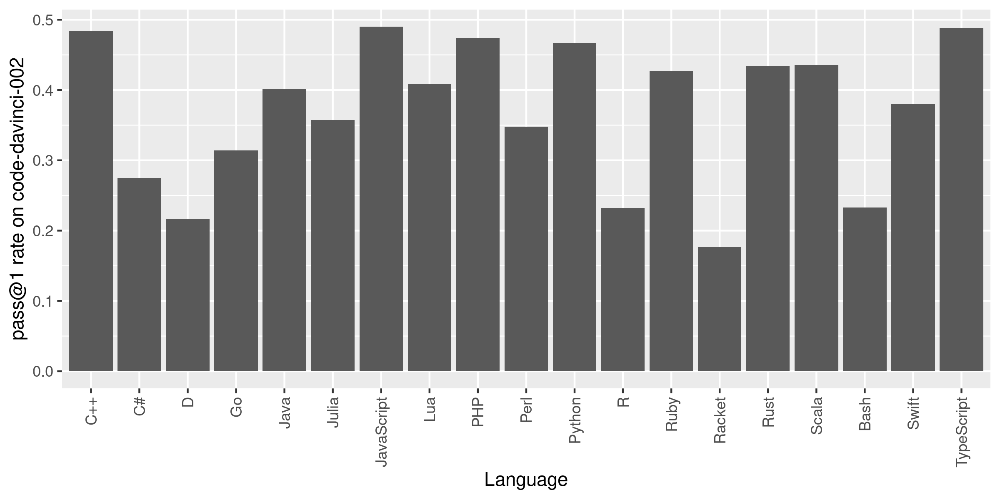

# Introduction

*MultiPL-E* is a multi-programming language benchmark for evaluating the code
generation performance of large language model (LLMs) of code.

We use a suite of compilers to translate the Python benchmarks from [Chen et al.
2021] into parallel benchmarks in 18 languages.  MultiPL-E provides a way to
evaluate code generation models on a consistent set of benchmark problems across
many languages. The 18 languages capture a broad spectrum of language features,
application areas, and popularity, allowing us to explore the impact of these
factors on model performance.

For example, the following graph shows the success rate of OpenAI Codex on the
benchmark problems across the full suite of programming languages:

Our paper also reports the performance on InCoder, and presents more
in depth analyses. Some of our findings include:

1. Codex performs best on JavaScript and equally well on C++, Scala, and
   TypeScript as on Python.

2. Model perplexity is not strongly correlated with the correctness of generated
   code.

3. Type annotations have limited impact on model performance for gradually typed
   languages.

4. Model performance is correlated with language popularity, but some niche
   languages perform as well as more popular languages.

## Using MultiPL-E

The MultiPL-E benchmark and associated tools are open source and easy to extend.
Each compiler translates Python unit tests, doctests, and function signatures to
its target language. Because these program regions do not contain arbitrary
Python code, each compiler is much simpler than a full-fledged
compiler. It is easy to add new benchmark programs and to
extend the benchmark to additional languages. The [Tutorial] on this website
walks you through running our benchmarks and gives guidance on adding support
for new languages and benchmarks, and evaluating new models.

TODO: Description here, lifted from the paper

TODO: Arxiv link here

TODO: Carousel here

TODO: Awesome graph here.

[Chen et al. 2021]: https://arxiv.org/abs/2107.03374